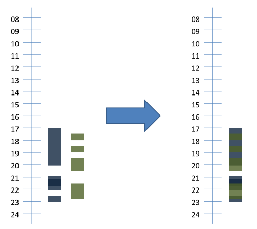
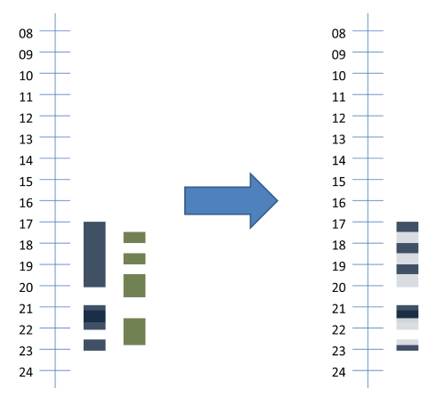

# TimePeriodHelper

- [TimePeriodHelper](#timeperiodhelper)
  - [Methods](#methods)
    - [sort](#sort)
    - [Data 時間資料](#data-時間資料)
    - [union](#union)
    - [diff](#diff)
    - [intersect](#intersect)
    - [isOverlap](#isoverlap)
    - [contact](#contact)
    - [greaterThan](#greaterthan)
    - [lessThan](#lessthan)
    - [fill](#fill)
    - [gap](#gap)
    - [time](#time)
    - [cut](#cut)
    - [extend](#extend)
    - [shorten](#shorten)
    - [format](#format)
    - [validate](#validate)
    - [filter](#filter)

## Methods

### sort

時間段排序 (正序)，先按照陣列前方的時間排序，再按照陣列後方的時間排序

- Description
  - sort( array `$timePeriods`) : array
- Parameters
  - $timePeriods (*array*) – 未排序時間陣列
- Returns
  - *array* - 已用正序排序陣列
- Example
  - 由於範例過多，請至tests的TimePeriodHelperTest.php觀看`testSort()`

### Data 時間資料

```php
 $templete1 =  [
            ['2019-01-04 17:00:00', '2019-01-04 20:00:00'],
            ['2019-01-04 21:00:00', '2019-01-04 21:40:00'],
            ['2019-01-04 21:20:00', '2019-01-04 22:00:00'],
            ['2019-01-04 22:30:00', '2019-01-04 23:00:00'],

        ];
  $templete2 = [
            ['2019-01-04 17:30:00', '2019-01-04 18:00:00'],
            ['2019-01-04 18:30:00', '2019-01-04 19:00:00'],
            ['2019-01-04 19:30:00', '2019-01-04 20:30:00'],
            ['2019-01-04 21:30:00', '2019-01-04 22:50:00'],
        ];
```

### union

時間段聯集，排序+合併有接觸的時間段

- Description
  - union( array ) : array
- Parameters
  - (*array*) – 未排序時間陣列，可一直接下去
- Returns
  - *array* - 已用正序排序陣列
- Example
  - 由於範例過多，請至tests的TimePeriodHelperTest.php觀看`testUnion()`
  -

  ```php
  use nueip\helpers\TimePeriodHelper;
  
  $result = TimePeriodHelper::union($templete1, $templete2);
  var_dump($result);
  ```

- Result

  ```php
  array(2) {
    [0]=>
    array(2) {
      [0]=>
      string(19) "2019-01-04 17:00:00"
      [1]=>
      string(19) "2019-01-04 20:30:00"
    }
    [1]=>
    array(2) {
      [0]=>
      string(19) "2019-01-04 21:00:00"
      [1]=>
      string(19) "2019-01-04 23:00:00"
    }
  }

  ```

- 圖示
  

### diff

時間段差集，將所有`$timePeriods1`時間段取得後，比較`$timePeriods2`的時間段，取得`$timePeriods1`中有，但是`$timePeriods2`中沒有的時間段

- Description
  - diff( array `$timePeriods1`, array `$timePeriods2` [, bool `$sortOut` ] ) : array
- Parameters
  - $timePeriods1 (*array*) – 被比較時間陣列
  - $timePeriods2 (*array*) – 比較時間陣列
  - $sortOut (*bool*) – 預設是 **default** 是否重新整理傳入的時間段 (是(true)、否(false)、使用setSortOut全域方式處理(default))
- Returns
  - *array* - `$timePeriods1`差集`$timePeriods2`陣列
- Example
  - 由於範例過多，請至tests的TimePeriodHelperTest.php觀看`testDiff()`
  -

  ```php
  use nueip\helpers\TimePeriodHelper;

  $result = TimePeriodHelper::diff($templete1, $templete2);
  var_dump($result);
  ```

- Result

  ```php
    array(5) {
    [0]=>
    array(2) {
      [0]=>
      string(19) "2019-01-04 17:00:00"
      [1]=>
      string(19) "2019-01-04 17:30:00"
    }
    [1]=>
    array(2) {
      [0]=>
      string(19) "2019-01-04 18:00:00"
      [1]=>
      string(19) "2019-01-04 18:30:00"
    }
    [2]=>
    array(2) {
      [0]=>
      string(19) "2019-01-04 19:00:00"
      [1]=>
      string(19) "2019-01-04 19:30:00"
    }
    [3]=>
    array(2) {
      [0]=>
      string(19) "2019-01-04 21:00:00"
      [1]=>
      string(19) "2019-01-04 21:30:00"
    }
    [4]=>
    array(2) {
      [0]=>
      string(19) "2019-01-04 22:50:00"
      [1]=>
      string(19) "2019-01-04 23:00:00"
    }
  }
  ```

- 圖示
  

### intersect

時間段交集，將所有`$timePeriods1`時間段取得後，比較`$timePeriods2`的時間段，取得`$timePeriods1`中有，並且`$timePeriods2`中也有的時間段

- Description
  - intersect( array `$timePeriods1`, array `$timePeriods2`[, bool `$sortOut` ] ) : array
- Parameters
  - $timePeriods1 (*array*) – 被比較時間陣列
  - $timePeriods2 (*array*) – 比較時間陣列
  - $sortOut (*bool*) – 預設是 **default** 是否重新整理傳入的時間段 (是(true)、否(false)、使用setSortOut全域方式處理(default))
- Returns
  - *array* - `$timePeriods1`交集`$timePeriods2`陣列
- Example
  - 由於範例過多，請至tests的TimePeriodHelperTest.php觀看`testIntersect()`
  -

  ```php
  use nueip\helpers\TimePeriodHelper;

  $result = TimePeriodHelper::intersect($templete1, $templete2);
  var_dump($result);
  ```

- Result

  ```php
  array(5) {
  [0]=>
  array(2) {
    [0]=>
    string(19) "2019-01-04 17:30:00"
    [1]=>
    string(19) "2019-01-04 18:00:00"
  }
  [1]=>
  array(2) {
    [0]=>
    string(19) "2019-01-04 18:30:00"
    [1]=>
    string(19) "2019-01-04 19:00:00"
  }
  [2]=>
  array(2) {
    [0]=>
    string(19) "2019-01-04 19:30:00"
    [1]=>
    string(19) "2019-01-04 20:00:00"
  }
  [3]=>
  array(2) {
    [0]=>
    string(19) "2019-01-04 21:30:00"
    [1]=>
    string(19) "2019-01-04 22:00:00"
  }
  [4]=>
  array(2) {
    [0]=>
    string(19) "2019-01-04 22:30:00"
    [1]=>
    string(19) "2019-01-04 22:50:00"
  }

  ```

### isOverlap

時間段是否有交集

- Description
  - isOverlap( array `$timePeriods1`, array `$timePeriods2`) : bool
- Parameters
  - $timePeriods1 (*array*) – 被比較時間陣列
  - $timePeriods2 (*array*) – 比較時間陣列
- Returns
  - *bool* - 是否交集
- Example
  - 由於範例過多，請至tests的TimePeriodHelperTest.php觀看`testIsOverlap()`
  -

  ```php
  use nueip\helpers\TimePeriodHelper;

  $result = TimePeriodHelper::isOverlap($templete1, $templete2);
   var_dump($result);
  ```

- Result

  ```php
  bool(true)
  ```

### contact

時間段與指定時間有關聯的時間段

- Description
  - contact( array `$timePeriods`, string `$sDateTime`, string `$eDateTime`[, mixed `$sortOut` ] ) : array
- Parameters
  - $timePeriods (*array*) – 被比較時間陣列
  - $sDateTime (*string*) – 開始時間
  - $eDateTime (*string*) – 結束時間
  - $sortOut (*bool|string*) – 預設是 **default** 是否重新整理傳入的時間段 (是(true)、否(false)、使用setSortOut全域方式處理(default))
- Returns
  - *array* - 時間段陣列
- Example
  - 由於範例過多，請至tests的TimePeriodHelperTest.php觀看`testContact()`
  -

  ```php
  use nueip\helpers\TimePeriodHelper;

  $result = TimePeriodHelper::contact($templete1, '2019-01-04 18:00:00');
  var_dump($result);
  ```

- Result

  ```php
  array(1) {
    [0]=>
    array(2) {
      [0]=>
      string(19) "2019-01-04 17:00:00"
      [1]=>
      string(19) "2019-01-04 20:00:00"
    }
  }
  ```

### greaterThan

時間段大於指定時間，並合併重複時間

- Description
  - greaterThan( array `$timePeriods`, string `$refDatetime`[, bool `$fullTimePeriod`[, mixed `$sortOut` ]] ) : array
- Parameters
  - $timePeriods (*array*) – 被比較時間陣列
  - $refDatetime (*string*) – 指定時間
  - $fullTimePeriod (*bool*) – 預設是 **true** 僅獲取整個時間段
  - $sortOut (*bool|string*) – 預設是 **default** 是否重新整理傳入的時間段 (是(true)、否(false)、使用setSortOut全域方式處理(default))
- Returns
  - *array* - 時間段陣列
- Example
  - 由於範例過多，請至tests的TimePeriodHelperTest.php觀看`testGreaterThan()`
  -

  ```php
  use nueip\helpers\TimePeriodHelper;

  $result = TimePeriodHelper::greaterThan($templete1, '2019-01-04 18:00:00');
  var_dump($result);
  ```

- Result

  ```php
  array(2) {
    [0]=>
    array(2) {
      [0]=>
      string(19) "2019-01-04 21:00:00"
      [1]=>
      string(19) "2019-01-04 22:00:00"
    }
    [1]=>
    array(2) {
      [0]=>
      string(19) "2019-01-04 22:30:00"
      [1]=>
      string(19) "2019-01-04 23:00:00"
    }
  }
  ```

### lessThan

時間段小於指定時間，並合併重複時間

- Description
  - lessThan( array `$timePeriods`, string `$refDatetime`[, bool `$fullTimePeriod`[, mixed `$sortOut` ]] ) : array
- Parameters
  - $timePeriods (*array*) – 被比較時間陣列
  - $refDatetime (*string*) – 指定時間
  - $fullTimePeriod (*bool*) – 預設是 **true** 僅獲取整個時間段
  - $sortOut (*bool|string*) – 預設是 **default** 是否重新整理傳入的時間段 (是(true)、否(false)、使用setSortOut全域方式處理(default))
- Returns
  - *array* - 時間段陣列
- Example
  - 由於範例過多，請至tests的TimePeriodHelperTest.php觀看`testLessThan()`
  -

  ```php
  use nueip\helpers\TimePeriodHelper;

  $result = TimePeriodHelper::lessThan($templete1, '2019-01-04 20:00:00');
  var_dump($result);
  ```

- Result

  ```php
  array(1) {
    [0]=>
    array(2) {
      [0]=>
      string(19) "2019-01-04 17:00:00"
      [1]=>
      string(19) "2019-01-04 20:00:00"
    }
  }
  ```

### fill

僅保留第一個開始時間和最後一個結束時間

- Description
  - fill( array `$timePeriods`) : array
- Parameters
  - $timePeriods (*array*) – 被比較時間陣列
- Returns
  - *array* - 時間段陣列
- Example
  - 由於範例過多，請至tests的TimePeriodHelperTest.php觀看`testFill()`
  -

  ```php
  use nueip\helpers\TimePeriodHelper;

  $result = TimePeriodHelper::fill($templete1);
  var_dump($result);
  ```

- Result

  ```php
  array(1) {
    [0]=>
    array(2) {
      [0]=>
      string(19) "2019-01-04 17:00:00"
      [1]=>
      string(19) "2019-01-04 23:00:00"
    }
  }
  ```

### gap

時間段間隙，在總範圍內，卻不在`$timePeriods`裡的時間段

- Description
  - gap( array `$timePeriods`[, bool `$sortOut` ] ) : array
- Parameters
  - $timePeriods (*array*) – 被比較時間陣列
  - $sortOut (*bool*) – 預設是 **default** 是否重新整理傳入的時間段 (是(true)、否(false)、使用setSortOut全域方式處理(default))
- Returns
  - *array* - 時間段陣列
- Example
  - 由於範例過多，請至tests的TimePeriodHelperTest.php觀看`testGap()`
  -

  ```php
  use nueip\helpers\TimePeriodHelper;

  $result = TimePeriodHelper::gap($templete1);
  var_dump($result);
  ```

- Result

  ```php
  array(2) {
    [0]=>
    array(2) {
      [0]=>
      string(19) "2019-01-04 20:00:00"
      [1]=>
      string(19) "2019-01-04 21:00:00"
    }
    [1]=>
    array(2) {
      [0]=>
      string(19) "2019-01-04 22:00:00"
      [1]=>
      string(19) "2019-01-04 22:30:00"
    }
  }
  ```
  
### time

計算時間段的總時間，計算單位(預設:秒)

- Description
  - time( array `$timePeriods`[, integer `$precision`[, bool `$sortOut` ]] ) : array
- Parameters
  - $timePeriods (*array*) – 被比較時間陣列
  - $precision (*integer*) – 預設是 **0** 小數精度位數
  - $sortOut (*bool*) – 預設是 **default** 是否重新整理傳入的時間段 (是(true)、否(false)、使用setSortOut全域方式處理(default))
- Returns
  - *array* - 時間段陣列
- Example
  - 由於範例過多，請至tests的TimePeriodHelperTest.php觀看`testTime()`
  -

  ```php
  use nueip\helpers\TimePeriodHelper;

  $result = TimePeriodHelper::time($templete1);
  var_dump($result);
  ```

- Result

  ```php
  int(16200)
  ```

### cut

裁剪時間段-依指定時間長度

- Description
  - cut( array `$timePeriods`, integer `$time`[, bool `$sortOut` ] ) : array
- Parameters
  - $timePeriods (*array*) – 被比較時間陣列
  - $time (*integer*) – 時間長度
  - $sortOut (*bool*) – 預設是 **default** 是否重新整理傳入的時間段 (是(true)、否(false)、使用setSortOut全域方式處理(default))
- Returns
  - *array* - 時間段陣列
- Example
  - 由於範例過多，請至tests的TimePeriodHelperTest.php觀看`testCut()`
  -

  ```php
  use nueip\helpers\TimePeriodHelper;

  $result = TimePeriodHelper::cut($templete1, 16100);
  var_dump($result);
  ```

- Result

  ```php
  array(3) {
    [0]=>
    array(2) {
      [0]=>
      string(19) "2019-01-04 17:00:00"
      [1]=>
      string(19) "2019-01-04 20:00:00"
    }
    [1]=>
    array(2) {
      [0]=>
      string(19) "2019-01-04 21:00:00"
      [1]=>
      string(19) "2019-01-04 22:00:00"
    }
    [2]=>
    array(2) {
      [0]=>
      string(19) "2019-01-04 22:30:00"
      [1]=>
      string(19) "2019-01-04 22:58:20"
    }
  }
  ```

### extend

延伸時間段，多加多少時間

- Description
  - extend( array `$timePeriods`, integer `$time`[, integer `$interval`[, bool `$sortOut` ]] ) : array
- Parameters
  - $timePeriods (*array*) – 被比較時間陣列
  - $time (*integer*) – 時間長度
  - $interval (*integer*) – 預設是 **0** 延伸時間段與原時間段間隔
  - $sortOut (*bool*) – 預設是 **default** 是否重新整理傳入的時間段 (是(true)、否(false)、使用setSortOut全域方式處理(default))
- Returns
  - *array* - 時間段陣列
- Example
  - 由於範例過多，請至tests的TimePeriodHelperTest.php觀看`testExtend()`
  -

  ```php
  use nueip\helpers\TimePeriodHelper;

  $result = TimePeriodHelper::extend($templete1, 1800);
  var_dump($result);
  ```

- Result

  ```php
  array(3) {
    [0]=>
    array(2) {
      [0]=>
      string(19) "2019-01-04 17:00:00"
      [1]=>
      string(19) "2019-01-04 20:00:00"
    }
    [1]=>
    array(2) {
      [0]=>
      string(19) "2019-01-04 21:00:00"
      [1]=>
      string(19) "2019-01-04 22:00:00"
    }
    [2]=>
    array(2) {
      [0]=>
      string(19) "2019-01-04 22:30:00"
      [1]=>
      string(19) "2019-01-04 23:30:00"
    }
  }
  ```
  
### shorten

縮短時間段，減少多少時間

- Description
  - shorten( array `$timePeriods`, integer `$time`[, bool `$crossperiod`[, bool `$sortOut` ]] ) : array
- Parameters
  - $timePeriods (*array*) – 被比較時間陣列
  - $time (*integer*) – 時間長度
  - $crossperiod (*bool*) – 預設是 **true** 是否跨時間段
  - $sortOut (*bool*) – 預設是 **default** 是否重新整理傳入的時間段 (是(true)、否(false)、使用setSortOut全域方式處理(default))
- Returns
  - *array* - 時間段陣列
- Example
  - 由於範例過多，請至tests的TimePeriodHelperTest.php觀看`testShorten()`
  -

  ```php
  use nueip\helpers\TimePeriodHelper;

  $result = TimePeriodHelper::shorten($templete1, 1800);
  var_dump($result);
  ```

- Result

  ```php
  array(2) {
    [0]=>
    array(2) {
      [0]=>
      string(19) "2019-01-04 17:00:00"
      [1]=>
      string(19) "2019-01-04 20:00:00"
    }
    [1]=>
    array(2) {
      [0]=>
      string(19) "2019-01-04 21:00:00"
      [1]=>
      string(19) "2019-01-04 22:00:00"
    }
  }
  ```
  
### format

格式轉換

- 如原本時間段格式為 Y-m-d H:i:s 時，指定轉換單位為 minute 時，會變成 Y-m-d H:i:00
- 如原本時間段格式為 Y-m-d H:i:s 時，指定轉換單位為 hour 時，會變成 Y-m-d H:00:00

- Description
  - format( array `$timePeriods`[, string `$unit` ] ) : array
- Parameters
  - $timePeriods (*array*) – 待轉換時間陣列
  - `$unit` (*string*) – 預設是 **default** 時間單位 (hour, minute, second)，如為default，使用`self::$_options`的設定(由setUnit()變更)
- Returns
  - *array* - 時間段陣列
- Example
  - 由於範例過多，請至tests的TimePeriodHelperTest.php觀看`testFormat()`
  -

  ```php
  use nueip\helpers\TimePeriodHelper;

  $result = TimePeriodHelper::format($templete1, 'hour');
  var_dump($result);
  ```

- Result

  ```php
  array(4) {
    [0]=>
    array(2) {
      [0]=>
      string(19) "2019-01-04 17:00:00"
      [1]=>
      string(19) "2019-01-04 20:00:00"
    }
    [1]=>
    array(2) {
      [0]=>
      string(19) "2019-01-04 21:00:00"
      [1]=>
      string(19) "2019-01-04 21:00:00"
    }
    [2]=>
    array(2) {
      [0]=>
      string(19) "2019-01-04 21:00:00"
      [1]=>
      string(19) "2019-01-04 22:00:00"
    }
    [3]=>
    array(2) {
      [0]=>
      string(19) "2019-01-04 22:00:00"
      [1]=>
      string(19) "2019-01-04 23:00:00"
    }
  }
  ```

### validate

驗証時間段格式，驗証格式、大小、時間

- Description
  - validate( array `$timePeriods`) : bool
- Parameters
  - $timePeriods (*array*) – 被驗證時間陣列
- Returns
  - *bool* - 是否為時間格式
- Example
  - 由於範例過多，請至tests的TimePeriodHelperTest.php觀看`testValidate()`
  -

  ```php
  use nueip\helpers\TimePeriodHelper;

  $result = TimePeriodHelper::validate($templete1);
  var_dump($result);
  ```

- Result

  ```php
  bool(true)
  ```

### filter

過濾時間段格式

- 驗証格式、大小、時間, 移除錯誤的資料(不報錯)
- 處理時間進位問題, 例： 2019-01-01 24:00:00 => 2019-01-02 00:00:00

- Description
  - filter( array `$timePeriods`) : array
- Parameters
  - $timePeriods (*array*) – 被過濾時間陣列
- Returns
  - *array* - 過濾後時間陣列
- Example
  - 由於範例過多，請至tests的TimePeriodHelperTest.php觀看`testFilter()`
